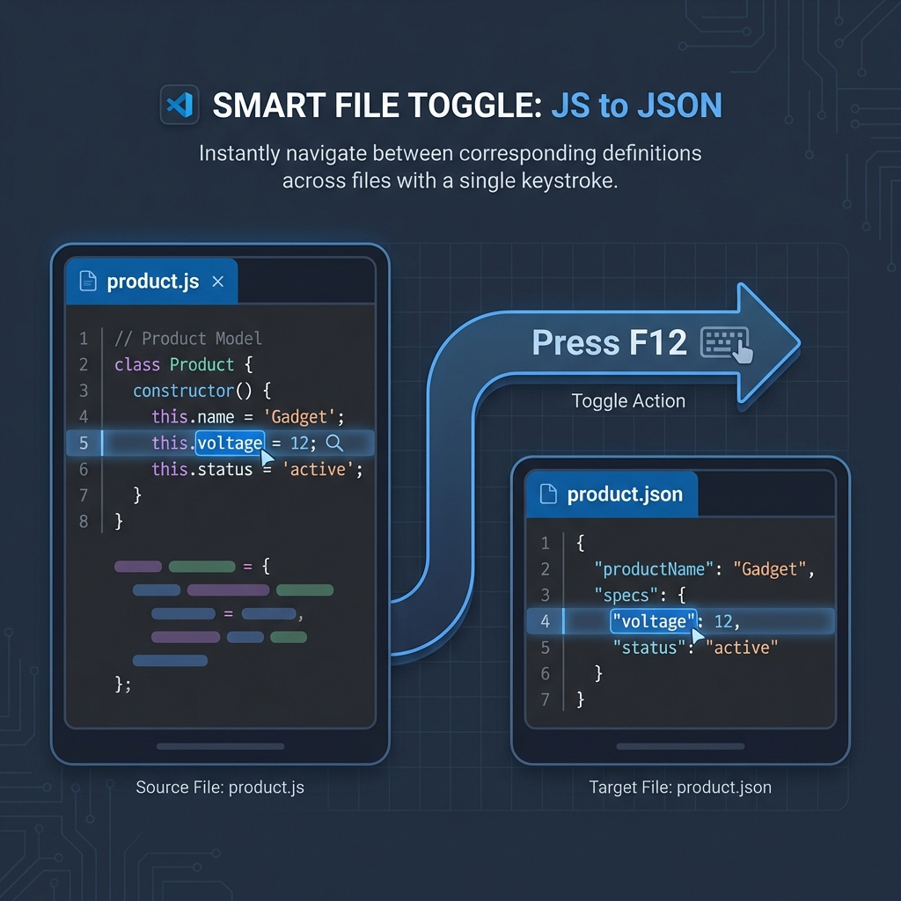

# DATEx2 Smart Navigation
DATE x2 Smart Navigation

This extension provides smart navigation features for DATEx2 development.

## Features

### 1. Instant Product File Toggle (F12)
*   **Press F12** while viewing a product `.js` or `.json` file.
*   Instantly opens the counterpart file (`.js` <-> `.json`).
*   **Smart Context Awareness:** Preserves cursor position within keys and values.



### 2. Translation Cache Toggle (Ctrl+F12)
*   **Press Ctrl+F12** on a text string or key in any file to jump to its entry in `translations.ai.cache.json`.
*   **Press Ctrl+F12** inside the translation cache file to jump back to the referenced source file (using the "refs" property).

### 3. Path Variable Expansion
*   Resolves `${variable}` paths in JSON document links and keys.


## Configuration

Set variables in your settings:
```json
{
  "products": "/absolute/path/to/products"
}
```
